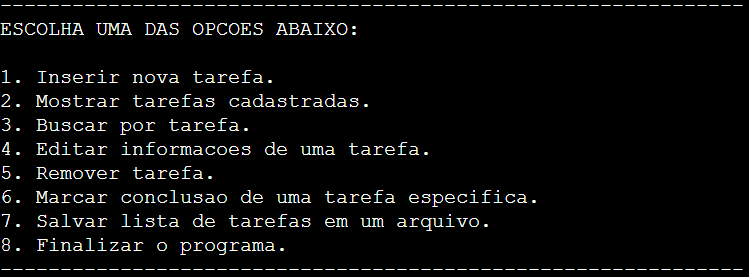

# Registro de Tarefas

Este projeto consiste em um Registro de Tarefas projetado para execução via terminal e desenvolvido
na linguagem C para o trabalho final da disciplina de Algoritmos e Programação Estruturada.
O sistema apresenta sete funcionalidades, cada uma projetada para interagir de forma direta com o usuário,
incluindo a possibilidade de editar e excluir tarefas previamente cadastradas e salvar a lista em um arquivo externo.

## Desenvolvedores

- Daniel
- João Pedro
- Erik
- Viktor

## Funcionalidades

| Desenvolvedores | Funcionalidades                           | Descrição                                                                                                                  |
| --------------- | ----------------------------------------- | -------------------------------------------------------------------------------------------------------------------------- |
| Daniel          | Inserir Nova Tarefa                       | Permite adicionar novas tarefas à lista, sendo que o usuário informa a quantidade de tarefas que deseja adicionar à lista. |
| Daniel          | Mostrar Tarefas Cadastradas               | Exibe a lista de todas as tarefas cadastradas.                                                                             |
| João Pedro      | Buscar por Tarefa                         | Realiza uma busca por uma tarefa específica na lista. A busca pode ser realizada através do título ou posição na lista.    |
| Erik            | Editar Informações de uma Tarefa          | Permite a edição das informações de uma tarefa existente.                                                                  |
| Viktor          | Remover Tarefa                            | Remove uma tarefa da lista.                                                                                                |
| Viktor          | Marcar Conclusão de uma Tarefa Específica | Permite marcar uma tarefa como concluída.                                                                                  |
| Erik            | Salvar Lista de Tarefas em um Arquivo     | Salva a lista de tarefas em um arquivo, incluindo informações sobre se cada tarefa foi finalizada ou não.                  |

## Impressão do Menu

1. **Layout do Menu:**

   - O menu é composto por uma série de linhas contendo as opções numeradas e uma breve descrição de cada funcionalidade.
   - Cada opção é apresentada em uma linha separada.

2. **Separadores Visuais:**

   - Linhas compostas por caracteres de traço (`-`) são utilizadas como separadores visuais, criando uma divisão clara entre o menu e o conteúdo exibido na tela.

3. **Opções Numeradas:**
   - Cada opção é apresentada com um número para facilitar a escolha do usuário. O indivíduo que deseja executar determinada ação deverá informar o seu número correspondente. **É importante destacar que algumas funcionalidades necessitam que a lista contenha pelo menos um item.**
